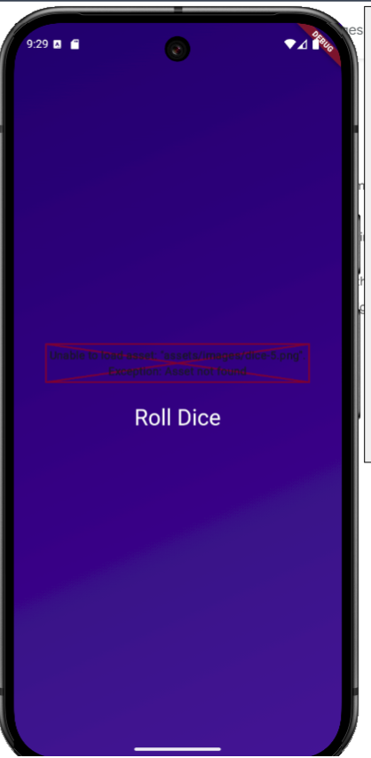
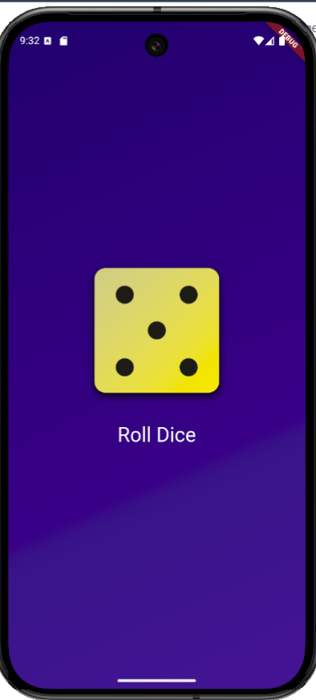

🎲 Dice Roller App
A simple Flutter app that simulates rolling a dice. The app displays a random dice face when the user presses the "Roll Dice" button.

📸 Screenshots
🖥️ Main Screen

🎲 Dice Faces

✨ Features
🎲 Roll a virtual dice with a single button press.

🖼️ Displays a random dice face (1 to 6) after each roll.

🎨 Simple and intuitive user interface.

🚀 Getting Started
📋 Prerequisites
Flutter SDK installed on your machine.

An IDE (e.g., Android Studio, Visual Studio Code) with Flutter and Dart plugins installed.

⚙️ Installation
Clone the repository:

bash
Copy
git clone https://github.com/your-username/dice-roller-app.git
Navigate to the project directory:

bash
Copy
cd dice-roller-app
Install dependencies:

bash
Copy
flutter pub get
▶️ Running the App
Connect a physical device or start an emulator.

Run the app:

bash
Copy
flutter run
🗂️ Project Structure
lib/main.dart: The main entry point of the application.

assets/images/: Contains the dice face images (dice-1.png to dice-6.png).

pubspec.yaml: Manages dependencies and assets.

🎮 Usage
Launch the app.

Press the "Roll Dice" button to roll the dice.

The app will display a random dice face.

🛠️ Troubleshooting
Asset Not Found: Ensure that the dice images are correctly placed in the assets/images/ directory and declared in the pubspec.yaml file.

yaml
Copy
flutter:
  assets:
    - assets/images/dice-1.png
    - assets/images/dice-2.png
    - assets/images/dice-3.png
    - assets/images/dice-4.png
    - assets/images/dice-5.png
    - assets/images/dice-6.png
🤝 Contributing
Contributions are welcome! Please open an issue or submit a pull request for any improvements or bug fixes.

📜 License
This project is licensed under the MIT License. See the LICENSE file for details.

🎉 Enjoy Rolling the Dice! 🎉
Icons Used
🎲: Dice

🖥️: Main Screen

📸: Screenshots

✨: Features

🚀: Getting Started

📋: Prerequisites

⚙️: Installation

▶️: Running the App

🗂️: Project Structure

🎮: Usage

🛠️: Troubleshooting

🤝: Contributing

📜: License